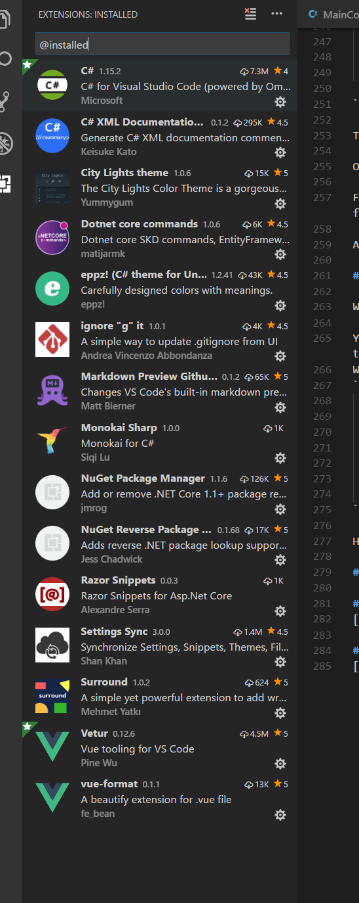

# aspnet-vuejs-basetemplate

#### V. 1.0.0

## What is this?

Honestly, I'm a software engineer, a backend man, however, someone that can't do frontends, grahpics, etc. I've always been fashinating by the UI world but my skills and my patience in the new __javascript-wtf-hell-packages-environment__ aren't the best.

I love .net core, working with asp net core for websites and web api and for UI until now I always used the classic approach: Razor pages + jquery.

One day I've met __Vue.js__. How you can imagine for a MVVM lover like me, with Vue has been love at first seen.

So I've tried to integrate it with aspnet core via __Microsoft SPA Templates__ but Vue was no present in it. My first approach was to check the code on github [JavscriptServices](https://github.com/aspnet/JavaScriptServices) and create a __VueDeveloperServer__ like for react, but after I've choose to use another approach to this scenario.

## Step to reproduce (tutorial for template creating, if you aren't interested you can jump this)

This you should don't do, just need to clone. However, this is how I created the template.

First thing, you need:

- node.js
- npm
- vue/cli
- .net core

#### 1. Get Node.js
Go to [nodejs website](https://nodejs.org/en/download/) and get node.js (on linux you can use apt or others package managers)

#### 2. Get npm

You can get npm by packages manager or via windows installer (don't know about mac)

#### 3. Get vue/cli

After that, you need to install the vue/cli this way via cli:
```bash
npm install -g @vue/cli
# OR
yarn global add @vue/cli
```
#### 4. Get .net core
Install __.net core__ from [here](https://www.microsoft.com/net/learn/get-started-with-dotnet-tutorial) (installation changes by OS, check the link). However if you read this I suppose you already know how .net core works.

### Setup

#### 1. Create asp net core project

Go in your target folder (for example: __mywebapp__)and via cli write:
After that, you need to install the vue/cli this way via cli:
```bash
dotnet new webapi
```

This will create the standard webapi project.

#### 1. Create vue webpack project and merge it in above

Now go back to parent folder and init Vuejs this way:
After that, you need to install the vue/cli this way via cli:
```bash
cd ..
# use the folder name for vue project name
vue init webpack mywebapp
```
Vue will ask you if you want proceed because the folder already exists. Tip Y.

You can setup the environment how you want, the template has:
- standard eslint
- vue router

After that, change directory and launch
```bash
cd mywebapp
# package is create by init and it will also run the install, but sometimes doesn't work, so you can force to call it again
npm install
```
#### 3. Run dev or build

Now if you can run:
```bash
# this will launch the webpack server on port 8080 and IT IS NOT ASPNET CORE 
npm run dev
# OR
# this will be build the application in dist folder, where when you launch aspnetcore server it works
npm run build
```
#### 4. Config asp net core startup file to works with Vue

For now just trust me, you will find the explanation about this in __Double Server Question__ section

in __Startup.cs__ file you must add this middlewares before _app.UseMVC()_:

```csharp
    // Set static files to dist folder generated by webpack
    app.UseStaticFiles(new StaticFileOptions
    {
        FileProvider = new PhysicalFileProvider(
            Path.Combine(Directory.GetCurrentDirectory(), "dist/static")),
        RequestPath = "/static"
    });

#if DEBUG
    // cors policy for work with double server
    app.UseCors(builder =>
        builder.WithOrigins("http://localhost:8080").AllowAnyHeader().AllowAnyMethod());
#endif
    // manage your 404 redirects from server
    app.Use(async (context, next) =>
                        {
                            await next.Invoke();
                            if (context.Response.StatusCode == 404)
                                context.Response.Redirect("/");
                        });

```

Now choose your main controller and set it this way (this is the startup, you can add stuff without problem) to serve your main entrypoint:
```csharp
using System;
using System.Collections.Generic;
using System.IO;
using System.Linq;
using System.Threading.Tasks;
using Microsoft.AspNetCore.Mvc;
using Newtonsoft.Json.Linq;

namespace aspnet_vuejs_basetemplate.Controllers
{
    // this will give you the main entry point for your app
    [Route("")]
    [ApiController]
    public class MainController : ControllerBase
    {
        [HttpGet]
        [Route("")]
        [Produces("text/html")]
        public async Task<IActionResult> Get()
        {
            var code = "";
            try
            {
                using (var stream = new FileStream("dist/index.html", FileMode.Open))
                {
                    using (var sreader = new StreamReader(stream))
                    {
                        code = await sreader.ReadToEndAsync();
                    }
                }
            }
            catch 
            {
                code = @"You should launch: ""npm run build"" for the first time";
            }
            return new ContentResult()
            {
                Content = code,
                ContentType = "text/html",
            };
        }
        // Just example method
        [HttpGet("serverData")]
        [Produces("application/json")]
        public ActionResult<string> ServerData()
        {
            return Ok(new { Text = "Hi! I'm from server!" });
        }

    }
}

```
Now if you launch the asp net core server you'll get __catch__ message. You should build with _npm run build_ command to work with aspnetcore.
However, you'll see that the build command is important only on the final step of the webapp, before you will works __with webpackserver.__

This is the initial configuration. Now I'll give to you an explanation about how it works.

## Works from the template

You just need to clone the template and after that you can work on it, but before you also need an explanation about I tought this template.

## Double server question

### How template is done

You have to think like an App developer, you have __two__ entities in this project:
- Your UIApp (run on webpack server)
- Your WebApi (run on .net core server)

### Development mode
Your development mode should work this way:

- If you are working un the UI you can just launch the webpack server and works with __Vue__.
- If you need to work or test with api (remember, think about your site like an app) you can launch only the aspnetcore server

When you have done both, you should launch both server and work to complete and test your work, the code

```csharp
#if DEBUG
    // cors policy for work with double server
    app.UseCors(builder =>
        builder.WithOrigins("http://localhost:8080").AllowAnyHeader().AllowAnyMethod());
#endif
```
in debug mode works for this. 
It let you from your __UI Server__ (hot reload, eslint, etc) to works with __aspnet__ (api service for your app, tokens, etc.) directly.

#### UI Server

Running from webpack and give you all advantages of hot reload, eslint listenere, debug, etc.

Usually loaded on __http://localhost:8080__

#### Api server

The aspnet core server, it will give you the full access to the aspnet core server features. 

Usually loaded on __http://localhost:5000__ (you can set it on __Program.cs__ -\> __CreateWebHostBuilder__ method with __UseUrl__)

#### Proxy or not proxy, this isn't the problem

The __JavascriptServices__ from __Microsoft SPA__ templates use a __webproxy__ to redirect all requests from aspnet core server to the dev server, in this way you can launch only the aspnetcore server and this will execute the dev server (however, with react it works this way).

Advantages:

- You don't need to manage two server istances (one for UI and another for the services)
- You can start directly with relatives urls into the ajax code
- Basically, is more simple to configure (is a SPA MS template)

However I preferred no-proxy approach (maybe it's a matter of taste), because with the above little configuration I've:

Advantages:
- I can work with servers on different machines without a particular configuration
- I can work only on UI or only on WS more quickly and test when server is out
- If I made a change in aspnet core I need to rebuild every time, in this way I can just use it like an external service to reboot, with proxy not

#### Routing base logic

When someone tries to connect to your server with a direct url (expecially for UI), he'll get a 404 error, because also if in your webapp the routing via __Vue__ is done, the aspnetcore server doesn't know it.

We add a simple fix (that it can be more complex for your in according to your needs) to manage this via the aspnet middleware.

```csharp
        // manage your 404 redirects from server
    app.Use(async (context, next) =>
                        {
                            await next.Invoke();
                            if (context.Response.StatusCode == 404)
                                context.Response.Redirect("/");
                        });

```

The middleware will redirect to your app entrypoint if someone will try to access to a page directly via url. 

Obviously this is a really simple fix and can be done much better.

For example you should think about a fallbackurl with the redirect, maybe passing /?fburl=\<requestpath> where \<requestpath> is the requested path for previous request.

After you get into the main app, you just can read the fburl and route client to right page.

#### Static stuff

With aspnetcore we usually use __wwwroot__ like static files path. 

You now have two way to do this, or configure webpack to distribuite the app into __wwwroot__ directory or just configure aspnetcore (it is simpler)  to work with static files into dist directory.
We have done this with this code in __Startup.cs__ middleware:
```csharp
    // Set static files to dist folder generated by webpack
    app.UseStaticFiles(new StaticFileOptions
    {
        FileProvider = new PhysicalFileProvider(
            Path.Combine(Directory.GetCurrentDirectory(), "dist/static")),
        RequestPath = "/static"
    });
```

Hope this can help who want works with the wonderful [__Vue.js__](https://www.vuejs.org) with our __Asp net core__

## Note 

I'm using __visual studio code__ to work with aspnet core and Vue.js, if you use it too, you can find useful these extensions!



## About
[Andrea Vincenzo Abbondanza](http://www.andrewdev.eu)

## Donate
[Help me to grow up, if you want](https://payPal.me/andreabbondanza)